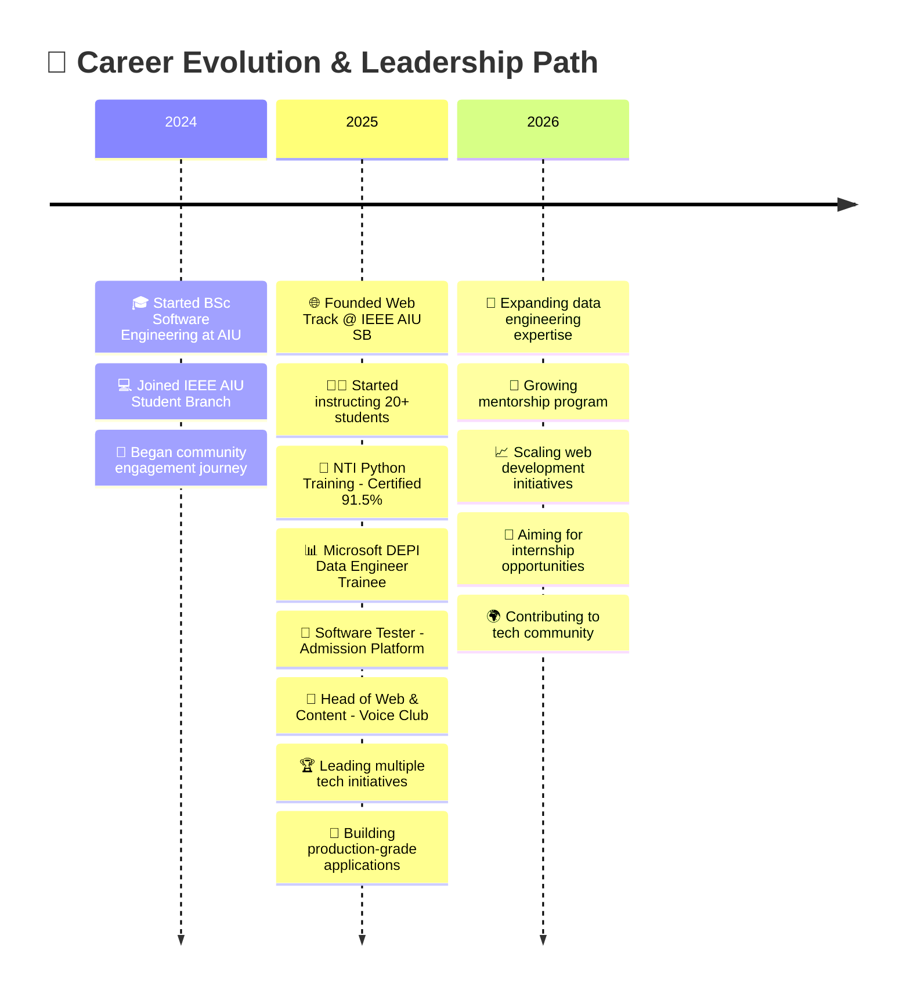

<div align="center">

<!-- Holographic Header with Particles -->


<!-- Animated Matrix Rain Effect Banner -->
<picture>
  <source media="(prefers-color-scheme: dark)" srcset="https://user-images.githubusercontent.com/74038190/225813708-98b745f2-7d22-48cf-9150-083f1b00d6c9.gif">
  
</picture>

<!-- Cyber Typing Effect with Multiple Lines -->
<a href="https://git.io/typing-svg">
  
</a>

<!-- Futuristic Social Badges -->
<p align="center">
  <a href="https://linkedin.com/in/omar-elshaer">
    
  </a>
  <a href="mailto:omar.reda.shaer@gmail.com">
    
  </a>
  <a href="https://github.com">
    
  </a>
  <a href="https://facebook.com/omaralshaer99">
    
  </a>
  <a href="https://instagram.com/@_.elshaer._">
    
  </a>
</p>

<!-- Live Visitor Counter with Gradient -->


</div>

---

<!-- Bio Section with Glassmorphism Effect -->
<div align="center">

##  WHO AM I?

</div>

<table width="100%">
<tr>
<td width="55%" valign="top">

```python
#!/usr/bin/env python3
"""
█████████████████ 
█ OMAR ELSHAER █
█████████████████
"""

class FullStackDeveloper:
    def __init__(self):
        self.name = "Omar Reda Elshaer"
        self.role = "Full-Stack Developer & Data Engineer"
        self.location = "🇪🇬 Alexandria, Egypt"
        self.university = "Alamein International University"
        self.year = "1st Year Software Engineering"
        self.phone = "+20 12 835 482 48"
        
    @property
    def current_stack(self):
        return {
            "languages": ["Python", "JavaScript", "C++", "Java", "TypeScript", "PHP", "SQL"],
            "web_frameworks": ["React.js", "Node.js", "Express.js", "Next.js", "Bootstrap"],
            "databases": ["MongoDB", "Firebase", "SQLite3", "MySQL", "Supabase"],
            "cloud": ["Microsoft Azure", "Netlify", "Vercel"],
            "tools": ["Git", "RESTful APIs", "PyQt", "JavaFX"],
            "specialties": [
                "🌐 Full-Stack Web Development",
                "📊 Data Engineering & Big Data",
                "⚡ Backend Architecture",
                "🎨 Front-End Design & UX",
                "🧪 Software Testing & QA",
                "👥 Team Leadership"
            ]
        }
    
    def current_mission(self):
        return [
            "🎯 Leading Web Track @ IEEE AIU Student Branch",
            "📈 Building production-grade web applications",
            "🏗️ Mastering Data Engineering with Microsoft Azure",
            "🌱 Mentoring 20+ students in web fundamentals",
            "💡 Creating systems that solve real-world problems",
            "🚀 Driving innovation in university tech community"
        ]
    
    def philosophy(self):
        return "Code is about people. Build with intention. Lead with empathy."

# Initialize
omar = FullStackDeveloper()
print(f"👾 Welcome to {omar.name}'s Digital Universe!")
```

</td>
<td width="45%" valign="top">


### 🎓 EDUCATION
**BSc in Software Engineering**  
📍 Alamein International University  
📅 Aug 2024 - July 2028  

### 💼 CURRENT POSITIONS
**Head of Web & Content**  
🏢 AIU Voice Club  
📅 Oct 2025 - Present  

**Web Track Instructor**  
🏢 IEEE AIU Student Branch  
📅 Feb 2025 - Present  

**Microsoft Data Engineer Trainee**  
🏢 Digital Egypt Pioneers Initiative (DEPI)  
📅 Jun 2025 - Present  

### 🌟 QUICK STATS
- 👥 **20+** Students Mentored
- 🌐 **6+** Web Projects
- 🏆 **2nd Place** Web Design (2021)
- 📜 **10+** Professional Certifications
- 💻 **Full-Stack** Competency

</td>
</tr>
</table>

<div align="center">

</div>

---

<!-- Tech Stack with Neon Glow Effect -->
<div align="center">

##  TECH WEAPONRY


### 💻 **CORE LANGUAGES**
<p>


</p>

### 🌐 **WEB FRAMEWORKS & LIBRARIES**
<p>


</p>

### 📊 **DATA & DATABASES**
<p>


</p>

### ☁️ **CLOUD & DEPLOYMENT**
<p>


</p>

### 🛠️ **DEV TOOLS & PLATFORMS**
<p>


</p>

### 🎨 **DESIGN & CREATIVITY**
<p>


</p>

</div>

<div align="center">

</div>

---

<!-- Premium Project Showcase -->
<div align="center">

##  FLAGSHIP PROJECTS

</div>

<table width="100%">

<!-- Row 1: O-Easy-TA & IEEE Website -->
<tr>
<td width="50%" valign="top">

<div align="center">

### 📚 **O-Easy-TA – Academic Management System**


[](https://github.com)
[](https://github.com)
[](https://github.com)

</div>

```yaml
🎯 Period: Jan 2025 – May 2025
🔬 Technology: Python + SQLite3 + Web Integration
⚡ Impact: Real-time data sharing
```

**🚀 KEY HIGHLIGHTS:**
- 📊 Robust backend using Python
- 🗄️ SQLite3 database design
- 🌐 Web platform integration for real-time updates
- 📈 Academic affairs data management
- 👥 Multi-user support system
- ⚙️ Clean architecture & maintainability

**💡 IMPACT:** Streamlining academic workflows for students and faculty

---

</td>

<td width="50%" valign="top">

<div align="center">

### 🌐 **IEEE AIU Student Branch Website**


[](https://github.com)
[](https://github.com)
[](https://github.com)

</div>

```yaml
🎯 Period: Feb 2025 – Present
🔬 Technology: React.js + Modern UI/UX
⚡ Mission: Showcase IEEE AIU initiatives
```

**🚀 KEY HIGHLIGHTS:**
- 🎨 Responsive modern design
- ⚡ React-based dynamic content
- 📱 Mobile-first approach
- 🌟 Interactive student engagement
- 📢 Event & workshop showcase
- 🔗 Community networking hub

**💡 IMPACT:** Building a vibrant online community for tech enthusiasts

---

</td>
</tr>

<!-- Row 2: Voice Club & Transportation System -->
<tr>
<td width="50%" valign="top">

<div align="center">

### 🎤 **AIU Voice Club Website**


[](https://github.com)
[](https://github.com)
[](https://github.com)

</div>

```yaml
🎯 Period: Oct 2025 – Present
🔬 Role: Head of Web & Content
📊 Focus: Student media initiatives
```

**🚀 KEY HIGHLIGHTS:**
- 🎬 Media content showcase
- 📝 Blog & article management
- 🎨 Creative multimedia hub
- 👥 Student contributor platform
- 📊 Analytics & engagement tracking
- 🌟 Brand identity & storytelling

**💡 IMPACT:** Empowering student voices and creative expression

---

</td>

<td width="50%" valign="top">

<div align="center">

### 🚕 **Alamein University Transportation System**


[](https://github.com)
[](https://github.com)
[](https://github.com)

</div>

```yaml
🎯 Period: Jul 2025 – Aug 2025
🔬 Technology: Full-Stack Development
⚡ Purpose: Campus mobility solution
```

**🚀 KEY HIGHLIGHTS:**
- 🚕 Transportation logistics system
- 📍 Route optimization & tracking
- 👥 Student & shuttle management
- 📊 Scheduling & analytics
- 🎯 User-friendly interface
- ⚙️ Scalable backend architecture

**💡 IMPACT:** Improving campus transportation efficiency and student experience

---

</td>
</tr>

<!-- Row 3: Additional Projects -->
<tr>
<td width="50%" valign="top">

<div align="center">

### 🎨 **Soul Art Hub Website**


[](https://github.com)
[](https://github.com)
[](https://github.com)

</div>

```yaml
🎯 Period: Mar 2025 – Aug 2025
🔬 Technology: Web Design & Development
⚡ Purpose: Showcase creative work
```

**🚀 KEY HIGHLIGHTS:**
- 🎨 Portfolio showcase platform
- 📸 Gallery management system
- 🌟 Artist profile pages
- 📱 Responsive design
- 🛒 Integration-ready structure
- ✨ Modern aesthetic

**💡 IMPACT:** Providing a digital stage for artists and creators

---

</td>

<td width="50%" valign="top">

<div align="center">

### 🔍 **University Admission System (QA)**


[](https://github.com)
[](https://github.com)
[](https://github.com)

</div>

```yaml
🎯 Period: Jun 2025 – Sep 2025
🔬 Role: Software Tester
⚡ Focus: Quality & Reliability
```

**🚀 KEY HIGHLIGHTS:**
- 🧪 Comprehensive test planning
- ✅ Functionality verification
- 🔐 Security & data integrity testing
- 👥 User experience validation
- 📋 Bug documentation & reporting
- 📈 Performance optimization

**💡 IMPACT:** Ensuring smooth admission processes for students

---

</td>
</tr>

</table>

<div align="center">

</div>

---

<!-- Professional Experience Timeline -->
<div align="center">

##  PROFESSIONAL JOURNEY

</div>



<details open>
<summary><b>🌐 Head of Web & Content – AIU Voice Club</b> | <i>Oct 2025 - Present</i></summary>
<br/>

<table>
<tr>
<td width="50%">

**🎯 ROLE & RESPONSIBILITIES:**
- 🎨 Lead web and content creation initiatives
- 📱 Coordinate student media projects
- 🌟 Manage club website & digital presence
- 👥 Oversee content calendar & publications
- 🤝 Collaborate with student creators

</td>
<td width="50%">

**💡 KEY ACHIEVEMENTS:**
- ✅ Launched modern Voice Club website
- 📊 Increased content engagement
- 👥 Built creative team culture
- 🎬 Managed multimedia projects
- 📈 Grew student participation

</td>
</tr>
</table>

</details>

<details open>
<summary><b>👨‍🏫 Web Track Instructor & Member – IEEE AIU SB</b> | <i>Feb 2025 - Present</i></summary>
<br/>

<table>
<tr>
<td width="50%">

**🎯 ROLE & RESPONSIBILITIES:**
- 📚 Deliver web fundamentals training
- 👥 Mentor 20+ students
- 🛠️ Manage web development projects
- 📋 Design structured curriculum
- 🤝 Foster collaborative learning

</td>
<td width="50%">

**💡 KEY ACHIEVEMENTS:**
- ✅ Trained 20+ students successfully
- 🌐 Founded IEEE Web Track
- 📖 Created learning materials
- 🏆 Built strong community
- 🚀 Launched student projects

</td>
</tr>
</table>

</details>

<details open>
<summary><b>📊 Microsoft Data Engineer Trainee – DEPI</b> | <i>Jun 2025 - Present</i></summary>
<br/>

<table>
<tr>
<td width="50%">

**🎯 SPECIALIZATION AREAS:**
- 🗄️ SQL & Database Management
- 📊 Data Pipelines & ETL
- 🌩️ Big Data Processing
- ☁️ Microsoft Azure Services
- 🤖 AI for Data Engineering

</td>
<td width="50%">

**💡 SKILLS ACQUIRED:**
- ✅ Advanced SQL optimization
- 📈 Data pipeline architecture
- ☁️ Azure data services
- 🔬 Statistical analysis
- 💼 Professional project experience

</td>
</tr>
</table>

</details>

<details>
<summary><b>🧪 Software Tester – Admission Platform</b> | <i>Jun 2025 - Sep 2025</i></summary>
<br/>

<table>
<tr>
<td width="50%">

**🎯 TESTING RESPONSIBILITIES:**
- ✅ Functionality & integration testing
- 🔐 Security & data validation
- 👥 User experience verification
- 📋 Bug documentation & reporting
- 📊 Test case development

</td>
<td width="50%">

**💡 ACHIEVEMENTS:**
- ✅ Ensured system reliability
- 🐛 Identified critical issues
- 📈 Improved user experience
- 🎯 Maintained quality standards
- 🤝 Cross-team collaboration

</td>
</tr>
</table>

</details>

<details>
<summary><b>🐍 Python Programming – National Telecom Institute</b> | <i>Jul 2025 - Aug 2025</i></summary>
<br/>

<table>
<tr>
<td width="50%">

**📚 PROGRAM DETAILS:**
- 🎓 120 Hours (90 technical + 30 freelancing)
- 🏆 Certificate: 91.5% Score
- 👨‍💻 Hands-on Python development
- 💼 Real-world project experience
- 🤝 Industry mentor guidance

</td>
<td width="50%">

**🎯 SKILLS MASTERED:**
- 🐍 Python fundamentals & OOP
- 📊 Data structures & algorithms
- 💻 Web frameworks
- 🗄️ Database integration
- 🚀 Project deployment

</td>
</tr>
</table>

</details>

<details>
<summary><b>📚 Other Leadership Roles</b></summary>
<br/>

**Scientific & Technology Committee Member - AIU Student Union**
- Organizing tech events and student initiatives
- Building campus tech ecosystem
- Supporting innovation competitions

**Community Volunteer**
- Active robotics competition participant (ROV Egypt - April 2025)
- Coding challenge competitor (ECPC - 2024)
- IEEE member and contributor

</details>

<div align="center">

</div>

---

<!-- Skills Breakdown -->
<div align="center">

##  CORE COMPETENCIES

</div>

<table width="100%">
<tr>
<td width="50%" valign="top">

### 💻 **TECHNICAL EXPERTISE**

**Programming Languages:**
```yaml
JavaScript:     ████████████████████ 92%
Python:         ████████████████░░░░ 85%
C++:            ████████████████░░░░ 85%
Java:           ███████████████░░░░░ 80%
TypeScript:     ███████████████░░░░░ 80%
SQL:            ████████████████░░░░ 85%
PHP:            ██████████████░░░░░░ 75%
C#:             ██████████░░░░░░░░░░ 65%
```

**Web Development:**
- 🎨 Full-Stack Development (MERN)
- ⚛️ React.js & Component Architecture
- 🔌 Node.js/Express.js Backend
- 📱 Responsive & Mobile-First Design
- 🎯 RESTful API Design
- 🔐 Authentication & Authorization
- 📊 Database Design & Optimization

**Data Engineering:**
- 📊 Data Pipelines & ETL
- 🗄️ SQL & Database Management
- 🌩️ Big Data Processing
- ☁️ Microsoft Azure Services
- 📈 Data Modeling & Optimization
- 🔍 Analytics & Reporting

</td>
<td width="50%" valign="top">

### 🎨 **SOFT SKILLS & TOOLS**

**Professional Skills:**
```yaml
Team Leadership:    ████████████████████ 95%
Problem Solving:    ████████████████░░░░ 90%
Communication:      ███████████████████░ 95%
Mentoring:          ████████████████░░░░ 90%
Time Management:    ███████████████░░░░░ 85%
Creativity:         ████████████████░░░░ 90%
```

**Development Tools:**
- 🔧 Git & GitHub (Version Control)
- 💻 VS Code, Visual Studio
- 📓 Figma (UI/UX Design)
- 🖌️ Adobe Illustrator & After Effects
- 💾 Database Management Tools
- 🌐 RESTful API Testing Tools
- ☁️ Microsoft Azure Portal
- 🐧 Linux Command Line

**Other Skills:**
- 📋 Project Management
- 🧪 Software Testing & QA
- 📊 Data Analysis & Visualization
- 📄 Technical Documentation
- 🎨 UI/UX Design Principles
- 🎬 Multimedia Content Creation
- 👥 Student Mentoring & Teaching
- 📢 Event Organization & Leadership

</td>
</tr>
</table>

<div align="center">

</div>

---

<!-- Certifications Section -->
<div align="center">

##  ACHIEVEMENTS & CERTIFICATIONS


</div>

<table width="100%">

<!-- Row 1: Major Certifications -->
<tr>
<td align="center" width="25%">

<br/>
<strong>📊 DEPI Microsoft Data Engineer</strong>
<br/>
<sub>In Progress - Capstone Project</sub>
<br/>
<sub>2025</sub>
<br/>

</td>

<td align="center" width="25%">

<br/>
<strong>🐍 NTI Python Programming</strong>
<br/>
<sub>Certificate - 91.5% Score</sub>
<br/>
<sub>August 2025</sub>
<br/>

</td>

<td align="center" width="25%">

<br/>
<strong>🌐 Full-Stack Developer</strong>
<br/>
<sub>Coursera Professional Certificate</sub>
<br/>
<sub>2025</sub>
<br/>

</td>

<td align="center" width="25%">

<br/>
<strong>🏆 Young Innovator Award</strong>
<br/>
<sub>2nd Place - Web Design</sub>
<br/>
<sub>2021</sub>
<br/>

</td>
</tr>

<!-- Row 2: Online Courses & Certifications -->
<tr>
<td align="center">

<br/>
<strong>☕ OOP in Java</strong>
<br/>
<sub>UC San Diego & Multiple Platforms</sub>
<br/>
<sub>2025</sub>
<br/>

</td>

<td align="center">

<br/>
<strong>⚡ OOP in C++</strong>
<br/>
<sub>MaharaTech</sub>
<br/>
<sub>2024</sub>
<br/>

</td>

<td align="center">

<br/>
<strong>📊 Data Structures</strong>
<br/>
<sub>University of Illinois Urbana-Champaign</sub>
<br/>
<sub>2025</sub>
<br/>

</td>

<td align="center">

<br/>
<strong>📈 Statistics & Logic</strong>
<br/>
<sub>Duke University & University of Leeds</sub>
<br/>
<sub>2024-2025</sub>
<br/>

</td>
</tr>

<!-- Row 3: DEPI Specialization Courses -->
<tr>
<td colspan="4" align="center" style="padding: 20px;">
<h3>📚 DEPI Specialization Courses</h3>
<p style="font-size: 14px;">
✅ Prompt Engineering | SQL & Database Management | Advanced Python | Data Pipelines | Big Data Processing | 
Microsoft Azure Data Engineer | AI for Data Engineers | Programming Essentials | Intro to Data Engineering
</p>
</td>
</tr>

<!-- Row 4: Online Learning Platforms -->
<tr>
<td colspan="4" align="center" style="padding: 20px;">
<h3>🎓 Additional Online Certifications</h3>
<p style="font-size: 14px;">
📚 SQL for Data Science with R (IBM) | Introduction to R Programming (IBM) | Advanced Python for Data Engineering | 
Object-Oriented Programming (Multiple Platforms)
</p>
</td>
</tr>

</table>

<div align="center">

</div>

---

<!-- Competitions & Awards -->
<div align="center">

## 🏆 COMPETITIONS & RECOGNITIONS

</div>

<table width="100%">
<tr>
<td align="center" width="33%">

<br/>
<strong>🥈 Young Innovator National</strong>
<br/>
<strong>2nd Place - Web Design</strong>
<br/>
<sub>2021</sub>
<br/>

</td>

<td align="center" width="33%">

<br/>
<strong>🤖 ROV Egypt Regional</strong>
<br/>
<strong>Participation Certificate</strong>
<br/>
<sub>April 2025 - Software Team</sub>
<br/>

</td>

<td align="center" width="33%">

<br/>
<strong>💻 ECPC Problem Solving</strong>
<br/>
<strong>Participation Certificate</strong>
<br/>
<sub>2024 - Arab Academy</sub>
<br/>

</td>
</tr>
</table>

<div align="center">

</div>

---

<!-- Connect & Collaborate Section -->
<div align="center">

##  LET'S BUILD TOGETHER


### 🌐 **CONNECT WITH ME**

<p align="center">
  <a href="https://linkedin.com/in/omar-elshaer">
    
  </a>
  <a href="mailto:omar.reda.shaer@gmail.com">
    
  </a>
  <a href="https://facebook.com/omaralshaer99">
    
  </a>
  <a href="https://instagram.com/@_.elshaer._">
    
  </a>
</p>

### 📞 **CONTACT INFORMATION**

<table align="center">
<tr>
<td align="center">

<br/>
<strong>Email</strong>
<br/>
<code>omar.reda.shaer@gmail.com</code>
</td>
<td align="center">

<br/>
<strong>Phone</strong>
<br/>
<code>+20 12 835 482 48</code>
</td>
<td align="center">

<br/>
<strong>Location</strong>
<br/>
<code>Alexandria, Egypt 🇪🇬</code>
</td>
</tr>
</table>

### 🌟 **LANGUAGES**

<table align="center">
<tr>
<td align="center" width="50%">

<br/>
<strong>Arabic</strong>
<br/>
<sub>Native Speaker</sub>
<br/>
<code>████████████████████ 100%</code>
</td>
<td align="center" width="50%">

<br/>
<strong>English</strong>
<br/>
<sub>Professional Level</sub>
<br/>
<code>█████████████░░░░░░░ 80%</code>
</td>
</tr>
</table>

</div>

<div align="center">

</div>

---

<!-- Trophy Case -->
<div align="center">

##  LEADERSHIP & COMMUNITY

</div>

<table width="100%">
<tr>
<td align="center" width="50%">

### 👥 **MENTORSHIP & TEACHING**


- 👨‍🏫 **20+ Students Mentored** in Web Development
- 📚 Created structured learning curriculum
- 🎓 IEEE AIU Web Track Founder
- 🤝 Active community builder
- 📊 Track record of impact

</td>
<td align="center" width="50%">

### 🌟 **LEADERSHIP ROLES**


- 🎤 **Head of Web & Content** - Voice Club
- 👨‍💼 **Instructor & Mentor** - IEEE AIU
- 🎯 **Committee Member** - AIU Student Union
- 🌐 **Project Manager** - Multiple initiatives
- 🚀 **Innovation Advocate** - Tech community

</td>
</tr>
</table>

<div align="center">

</div>

---

<!-- Quote of the Day -->
<div align="center">

## 💭 **PHILOSOPHY & VISION**


<br/>


### 🎯 **2026 GOALS**

```python
goals_2026 = {
    "🎓 Education": "Excel in Software Engineering program",
    "💼 Career": "Secure internship in full-stack development",
    "🌐 Leadership": "Scale web community to 50+ students",
    "📊 Skills": "Master MERN stack & Azure deployment",
    "🚀 Projects": "Build 5+ production-grade applications",
    "🤝 Community": "Mentor 50+ aspiring developers",
    "🏆 Impact": "Create tools that solve real problems"
}

for goal, target in goals_2026.items():
    print(f"{goal} → {target}")
```

### ⚡ **FUN FACTS ABOUT ME**

```markdown
💻 I code better at night with lo-fi music
🎨 Design thinking is my superpower
📚 Always learning something new
🤝 Love teaching & mentoring others
🎯 Obsessed with clean, scalable code
🌍 Goal: Build tech that impacts lives
🎮 Game dev enthusiast in spare time
☕ Powered by coffee & passion for tech
🎵 Coding soundtrack: Lo-fi beats + focus music
🌟 Believe in collaborative problem-solving
```

</div>

<div align="center">

</div>

---

<!-- Footer Section -->
<div align="center">

### 💼 **OPEN TO OPPORTUNITIES**


<h3>
🚀 Available for:
<br/>
<code>Internships</code> | <code>Freelance Projects</code> | <code>Collaborations</code> | <code>Teaching & Mentoring</code>
</h3>

**Interested in Full-Stack Development, Data Engineering, Web Development, or Tech Community Building**

<br/>

### ⭐ **IF YOU LIKE MY WORK, DROP A STAR ON MY REPOS!**


<br/>

### 📊 **PROFILE STATISTICS**

<table align="center">
<tr>
<td align="center">

</td>
<td align="center">

</td>
<td align="center">

</td>
</tr>
</table>

<br/>

---

<h3>
💡 "Code is about people. Build with intention. Lead with empathy."
<br/>
<sub>- Omar Elshaer</sub>
</h3>

<br/>


<br/><br/>

**Made with** ❤️ **and lots of** ☕ **by Omar Elshaer**

<sub>Last Updated: January 2026 | Built with passion for Web Development & Community Leadership</sub>

<br/>

</div>

<!-- Final Wave Footer -->


</div>
